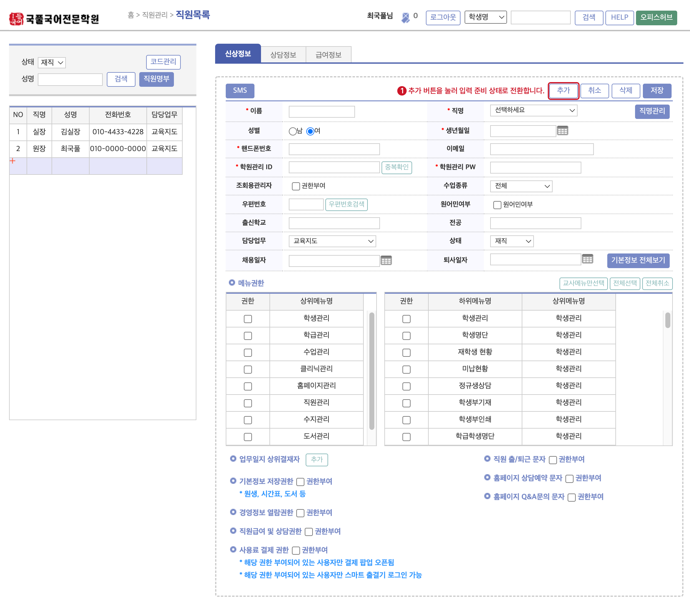
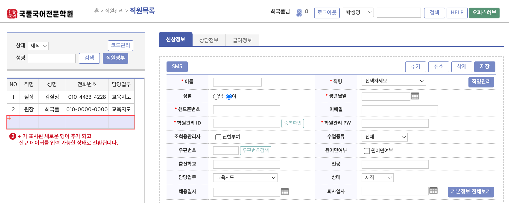
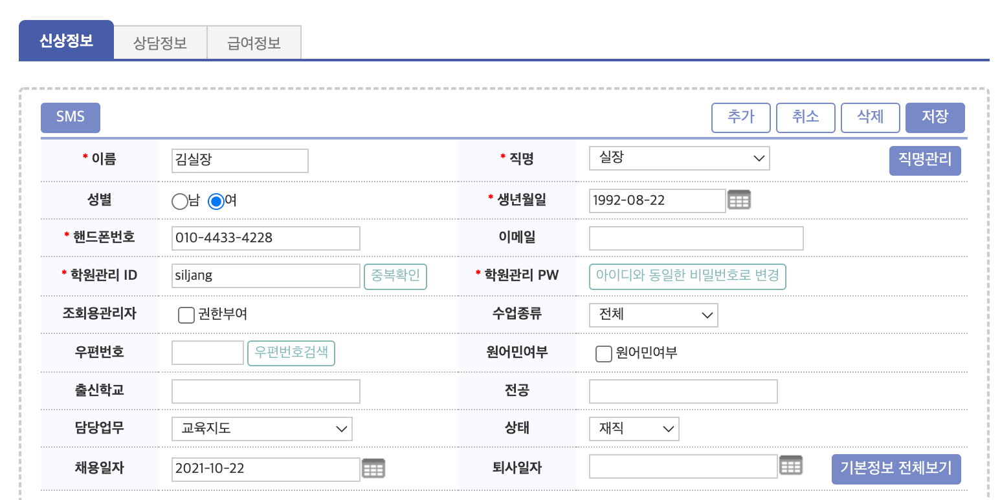
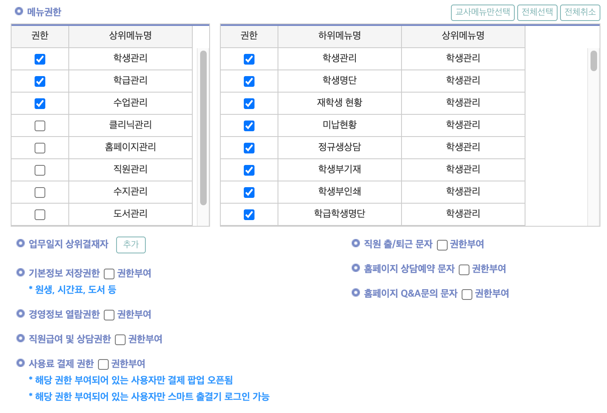

import 직명코드설정 from './img/01-직원추가/직명코드설정.png';
import 직명추가1 from './img/01-직원추가/직명추가-1.png';
import 직명추가2 from './img/01-직원추가/직명추가-2.png';
import 직명수정 from './img/01-직원추가/직명수정.png';
import 직명삭제 from './img/01-직원추가/직명삭제.png';
import 교사메뉴 from './img/01-직원추가/교사메뉴.png';
import 전체보기1 from './img/01-직원추가/전체보기-1.png';
import 전체보기2 from './img/01-직원추가/전체보기-2.png';
import 전체보기3 from './img/01-직원추가/전체보기-3.png';

# 직원 정보 추가

국풀임스 시스템을 사용할 직원 및 강사의 정보를 등록합니다.
:::info 사용 메뉴
**`관리메뉴`** → **`직원관리`** → **`직원목록`**
:::

## 직명 코드 설정

#### 직원 및 강사 정보를 입력하기에 앞서 학원에서 사용할 직명 코드를 세팅하는 작업이 필요합니다.

- 직원목록 화면의 왼쪽 상단 검색창에 있는 **`코드관리`**를 누르면 직업 관리 설정 화면이 호출 됩니다.

- 또는 직원 신상 정보 화면의 `직명관리` 버튼을 통해서도 접근 가능합니다.

- 개별 학원에서 사용하는 직명에 맞게 항목을 설정 합니다. 학원에서 많이 사용하는 직명 위주로 기본 값이 맞춰져 있으니 초기 설정 값 그대로 사용하셔도 무방합니다 😎

### 새로운 직명 추가

:::caution 입력 준비 상태 전환 **(모든 메뉴 공통 적용)**
신규 데이터 생성 시 **`추가`** 버튼을 눌러 **입력 준비 상태**로 만드는 과정이 반드시 선행되어야 합니다.
:::

`추가` 버튼을 눌러 입력 행을 추가합니다.

입력 행이 추가 되면 빈 칸을 눌러 직명을 입력할 수 있습니다. 입력 후 `저장` 버튼을 눌러 데이터를 저장합니다.

### 기존 직명을 수정
직명코드의 개별 항목을 누르면 내용을 수정할 수 있습니다. 수정 후에는 저장 버튼을 눌러 변경 사항을 저장합니다.

### 직명 삭제
`삭제` 버튼을 눌러 개별 항목을 삭제할 수 있습니다.

## 직원 추가

### 입력 준비
**`추가`** 버튼을 눌러 입력 준비 상태로 전환합니다.

`+` 가 표시된 입력 행이 추가 되고 신규 데이터를 입력 가능한 상태(항목이 빈칸으로 바뀜)로 전환 되고 데이터를 입력할 수 있습니다.

:::danger 취소 버튼
입력 준비 상태에서 저장을 누르지 않고 `취소` 버튼을 누르게 되면 입력 중인 정보가 삭제 됩니다. 😭
:::

### 신상 정보 입력
**`신상정보`** 탭의 빈칸에 정보를 입력 합니다. `*`로 표시된 필수 정보는 반드시 입력해야 합니다.

#### 개별 항목 설명
- __이름 : `필수` 직원의 이름__
- __직명 : `필수` 학원에서 부여하는 직명. [직명코드설정](/first-setting/register-member#직명-코드-설정)에서 세팅 된 값을 선택할 수 있습니다.__
- 성별 : 성별
- __생년월일 : `필수` 생년월일__
- __핸드폰번호 : `필수` 휴대전화 연락처__
- 이메일: 이메일을 입력
- 학원관리ID : 시스템 접속에 사용할 ID를 부여합니다. 영문 + 숫자 조합 6~12 자리.
- 학원관리PW : 시스템 접속에 사용할 PW를 지정합니다. 차후 비밀번호를 분실했을 경우 아이디와 동일하게 변경할 수 있습니다.
- 조회용관리자 : 조건 검색 시 전체를 지정해서 검색 가능 여부
- 수업종류 : 수업 과목을 선택합니다.
- 원어민여부 : 원어민 강사인 경우 체크
- 출신학교 : 출신학교
- 전공 : 전공
- 담당업무 : 담당 업무의 유형을 선택합니다.
- 상태 : 재직 여부 선택
- 채용일자 : 업무 또는 수업을 시작하는 날짜
- 퇴사일자 : 퇴사일

### 메뉴 접근 권한 부여
각 직원에게 메뉴 접근과 주요 기능의 사용 권한을 별도로 부여할 수 있습니다.

#### 개별 항목 설명

- 메뉴권한 : 각 메뉴에 대한 접근 권한 지정
- 업무일지 상위결재자 : 직원 정보 저장 후 수정 가능. 업무 일지의 상위결재자를 추가 합니다.
- 기본정보 저장권한 : ??
- 경영정보 열람권한 : 경영정보에 대한 열람 권한을 부여
- 직원급여 및 상담권한 : ??
- 사용료 결제 권한 : 시스템 사용료 결제와 스마트 출결기 로그인 권한을 부여합니다.
- 직원 출/퇴근 문자 : 직원 출퇴근 문자를 받아볼 수 있는 권한을 지정합니다.
- 홈페이지 상담예약 문자 : ??
- 홈페이지 Q&A문의 문자 : ??

:::caution
메뉴 접근 외 기타 사용 권한의 설정은 수동으로 설정해주셔야 합니다.
메뉴권한은 `전체선택` 및 `전체취소` 버튼을 이용해 일괄 부여 및 취소가 가능합니다.
:::
 

- 강사를 추가할 경우 **`교사메뉴만선택`**을 눌러 한 번에 권한 설정이 가능합니다.

### 저장 및 수정
신상 정보와 권한 설정이 완료 되었다면 **`저장`** 버튼을 눌러 데이터를 저장합니다.

### 추가 정보 입력 (선택 사항)
신상정보 탭의 퇴사일자 오른쪽에 위치한 __`기본정보 전체보기`__를 누르면 입력창이 아래로 확장되어 직원의 추가 정보를 입력할 수 있습니다.

창이 확장되면 버튼이 __`기본정보 요약보기`__로 변경 되고 다시 눌렀을 때 창이 원래대로 축소됩니다.

#### 개별 항목 설명
- 주소 : 직원의 거주지 주소
- 학위번호 : 학위번호
- 졸업년도 : 졸업년도
- 주요경력 : 주요 경력 사항을 기록합니다.
- 경력년수 : 경력년수
- 자격증 : 보유 자격증이 있다면 기재합니다.
- 계좌번호 : 계좌번호 기록
- 메모 : 특이사항을 기록합니다.
