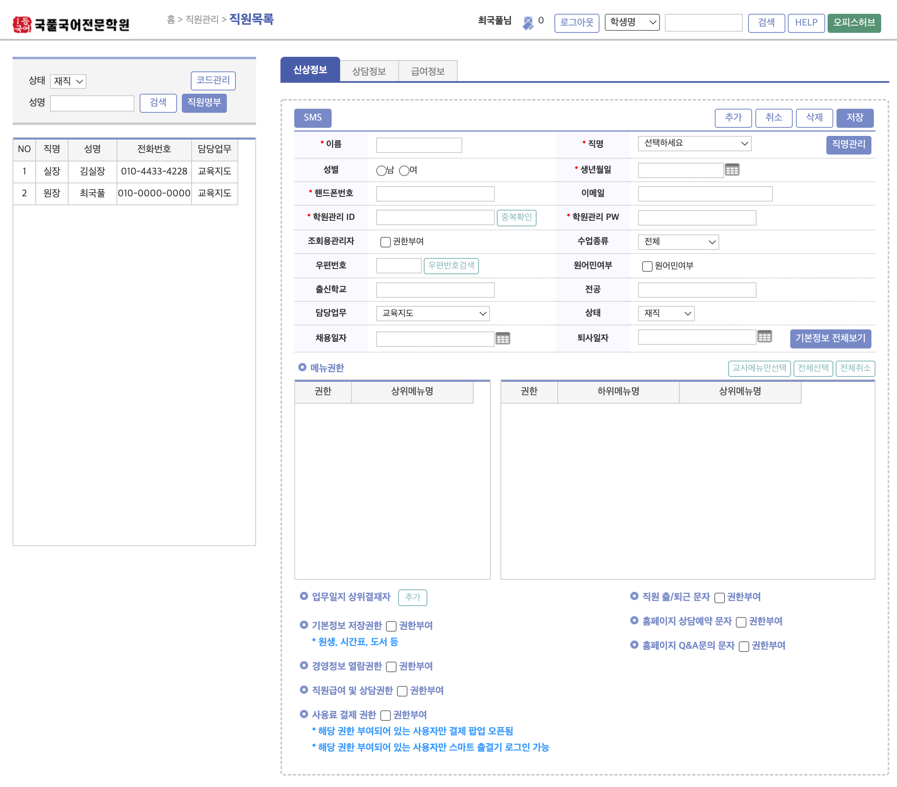
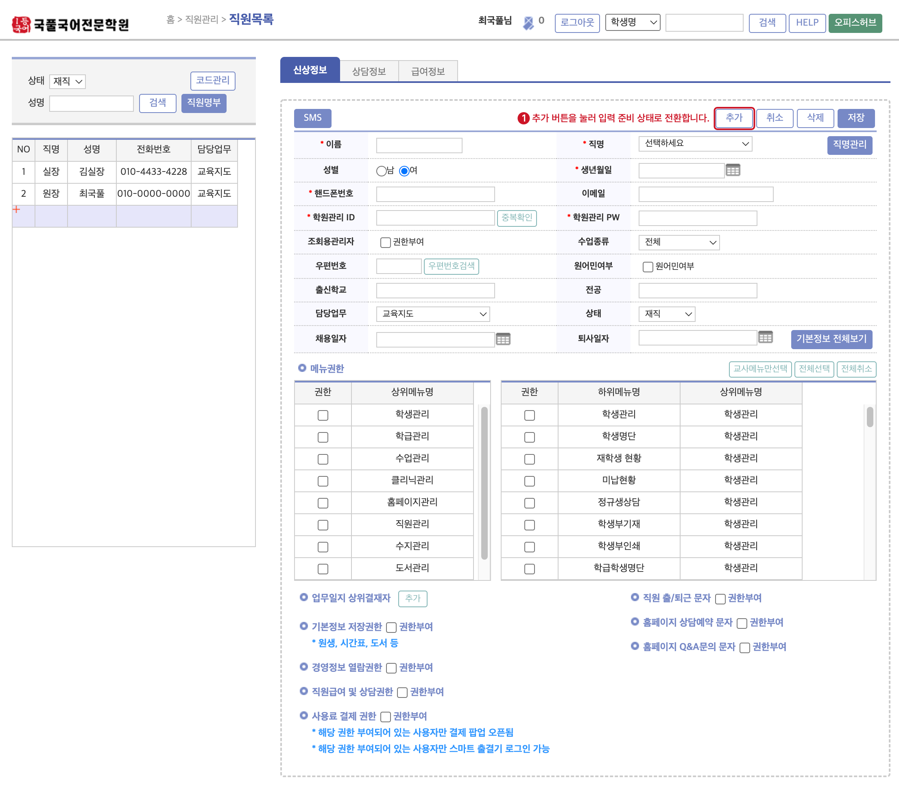
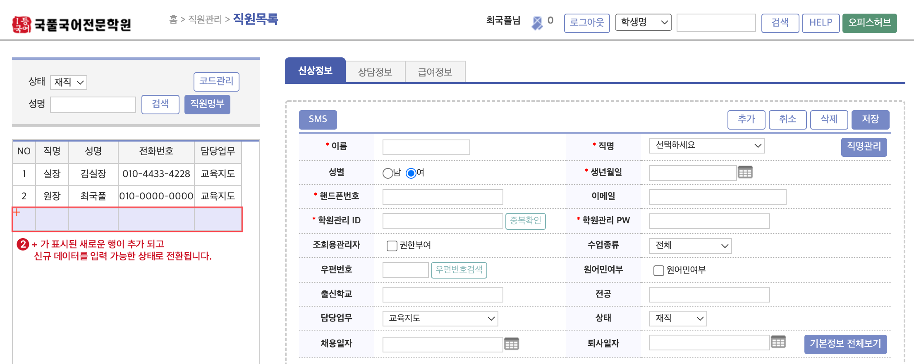
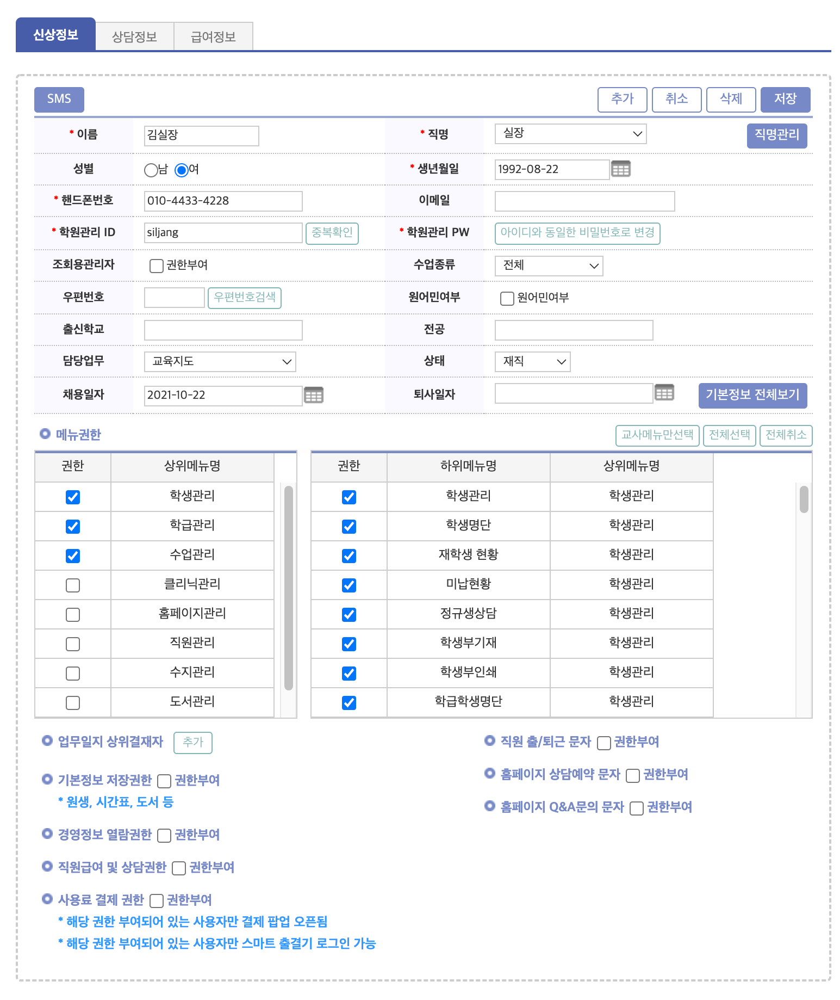
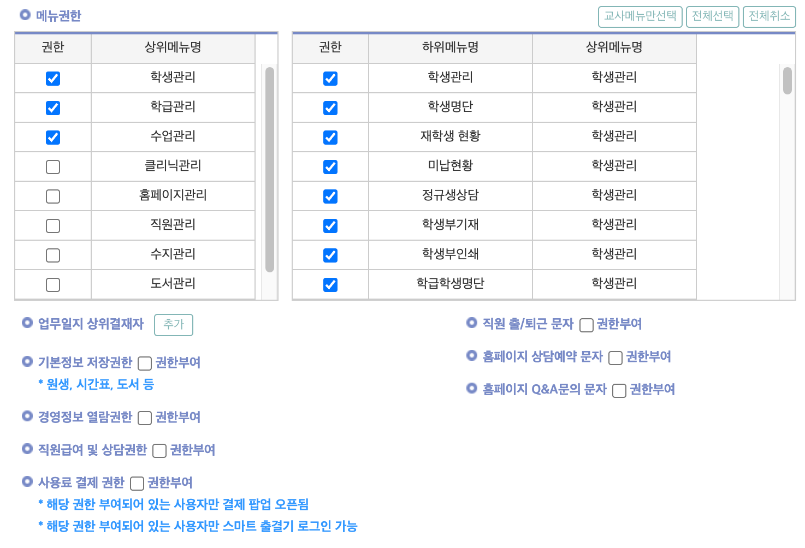
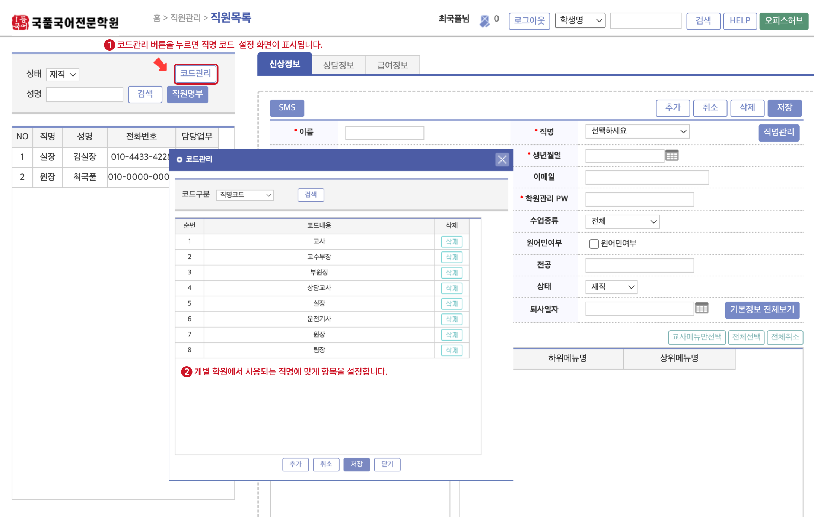
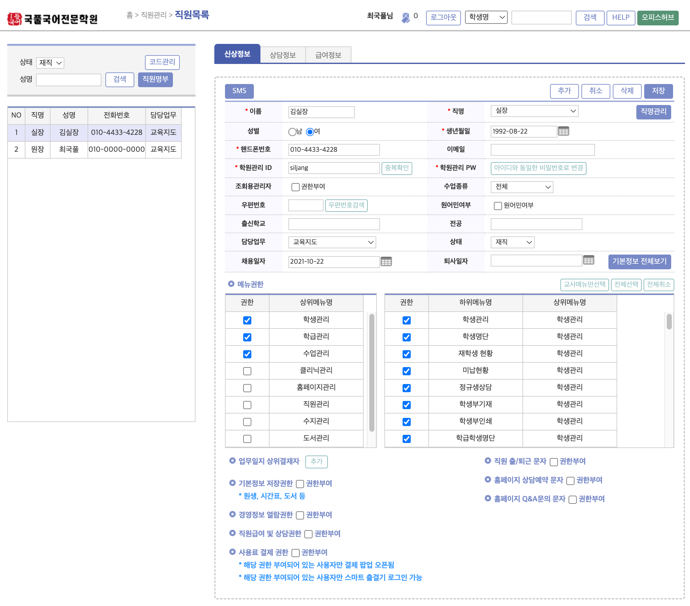

# 직원 정보 추가

국풀임스 시스템을 사용할 직원 및 강사의 정보를 등록합니다.
:::note 메뉴 찾아가기
**`관리메뉴`** → **`직원관리`** → **`직원목록`**
:::

## 직원 목록 화면 구성

## 등록 과정

### 개별 직원 데이터 추가
:::caution 입력 준비 상태 전환 **(모든 메뉴 공통 적용)**
신규 데이터 생성 시 **`추가`** 버튼을 눌러 **입력 준비 상태**로 만드는 과정이 반드시 선행되어야 합니다.
:::
1. **`추가`** 버튼을 눌러 입력 준비 상태로 전환합니다.

2. **`+`** 가 표시된 행이 추가 되고 신규 데이터를 입력 가능한 상태(항목이 빈칸으로 바뀜)로 전환 됩니다.

3. **`신상정보`** 탭의 빈칸에 정보를 입력 합니다.

4. 각 직원의 업무 범위에 맞게 메뉴 접근 권한을 부여 합니다. 강사의 경우 **`교사메뉴만 선택`**을 눌러 한 번에 체크가 가능합니다.

5. **`저장`** 버튼을 눌러 데이터를 저장합니다.

:::danger 취소 버튼
입력 준비 상태에서 저장을 누르지 않고 `취소` 버튼을 누르게 되면 입력 중인 정보가 삭제 됩니다.
:::

### 직명 코드 설정
학원 고유의 직명 코드를 세팅할 수 있습니다.

1. 직원목록 화면의 왼쪽 상단 검색창에 있는 **`코드관리`**를 누릅니다.
2. 개별 학원에서 사용하는 직명에 맞게 항목을 설정 합니다. 학원에서 많이 사용하는 직명 위주로 기본 값이 맞춰져 있으니 반드시 수정해야 하는 것은 아닙니다.
   
3. 새로운 직명을 입력 하려면 `추가` → 코드내용 입력 → `저장` 의 순서로 진행합니다.

### 강사 선택 시 화면
강사를 선택하면 아래와 같이 나옴

