import 개별추가4 from './img/02-학급세팅/개별추가-4.png';
import 교시시간설정 from './img/02-학급세팅/교시시간설정.png'
import 강의실관리 from './img/02-학급세팅/강의실관리.png'
import 과목관리 from './img/02-학급세팅/과목관리.png'
import 수업종류관리 from './img/02-학급세팅/수업종류관리.png'
import 수납항목관리 from './img/02-학급세팅/수납항목관리.png'
import 수납항목추가2 from './img/02-학급세팅/수납항목추가-2.png'
import 수납항목추가3 from './img/02-학급세팅/수납항목추가-3.png'

# 학급 세팅

수업이 진행되는 개별 학급을 생성하고 정보를 입력합니다.

:::info 사용 메뉴
**`기본메뉴`** → **`학급관리`** → **`학급관리`**
:::

## 공통 정보 세팅 (내용 추가 필요)

개별 학급 추가에 앞서 학급 세팅에 공통적으로 사용 되는 정보를 설정합니다.
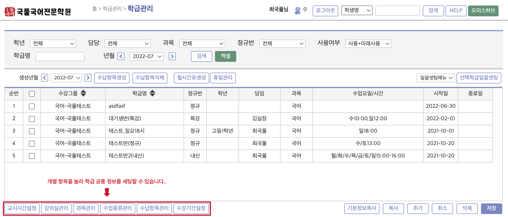

모든 공통 정보는 `기본메뉴` → `학생관리` → `학생관리` 의 **`코드관리`** 에서도 수정 가능합니다.
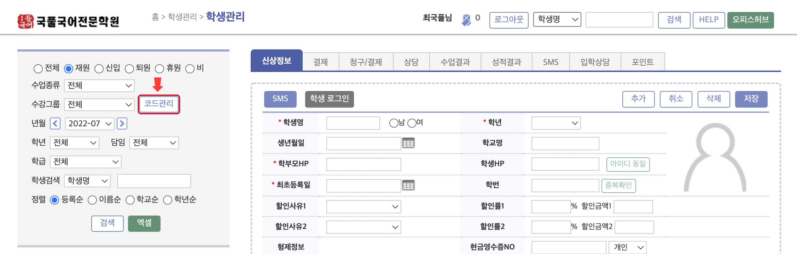

### 교시시간설정
학원 전체에 해당하는 교시 시간을 설정합니다.

### 강의실관리
수업이 진행되는 강의실 정보를 추가 할 수 있습니다.

### 과목관리
수업 과목을 관리합니다.

### 수업종류관리
수업의 종류와 수강 그룹을 설정할 수 있습니다. 수강 그룹은 필수 입력 사항입니다.

### 수납항목관리
수납 항목을 관리합니다. 개별항목에 대한 세부 설정은 [링크 추가 예정]을 참고바랍니다.

### 수강기간설정

## 새로운 학급 추가

### 입력 준비

**`추가`** 버튼을 눌러 입력 준비 상태로 전환합니다.
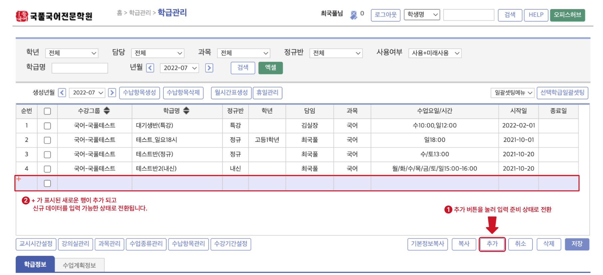

### 기본 정보 입력

입력 준비 상태가 되면 아래의 **`학급정보`** 탭에서 기본 정보를 우선 입력합니다.
_`*`는 필수 입력 항목입니다_

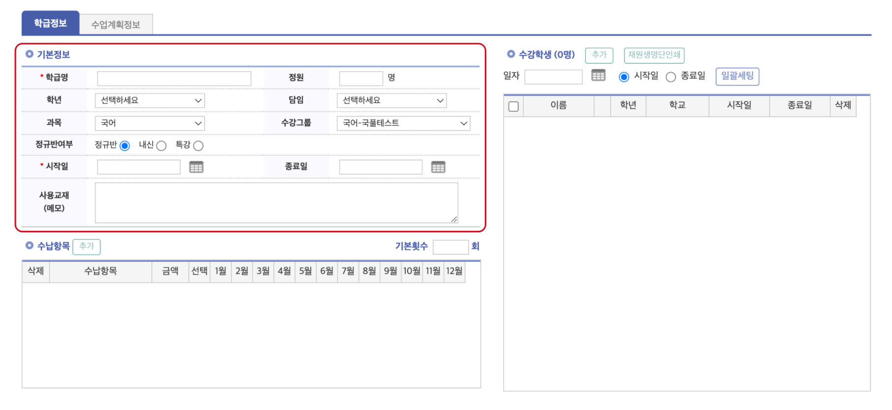

#### 개별 항목 설명 (수정 필요)

| 항목 | 입력 내용 | 비고 |
|----|----|
| __학급명__ | ___(필수)___ 학급의 이름을 입력합니다.|
| 정원 | 개별 학급의 수용 가능 인원 |
| 학년 | 학급 수강 대상 학년 (**수정 : ** `코드관리` → `학교구분/학년`)|
| 담임 | 담임 강사 선택 |
| 과목 | 과목명을 선택합니다. |
| 수강그룹 | 수강그룹을 선택합니다. |
| 정규반여부 | 정규반, 내신, 특강 중 하나를 선택|
| __시작일__ | ___(필수)___ 수업의 시작 날짜를 선택합니다.|
| 종료일 | 수업의 종료 날짜를 선택합니다. 종료일이 지정되면 선택 날짜 이후 학생이 퇴반 처리 됩니다. |
| 사용교재 | 사용하는 교재나 수업의 특이사항을 기록합니다. |

### 저장 및 수정
기본정보의 필수 값을 입력하면 학급 데이터를 __`저장`__ 할 수 있습니다. 
데이터를 저장하면 입력 행에 학급이 추가 되고 데이터 행을 눌러 입력 된 정보를 `확인` 하고 `수정`할 수 있습니다.
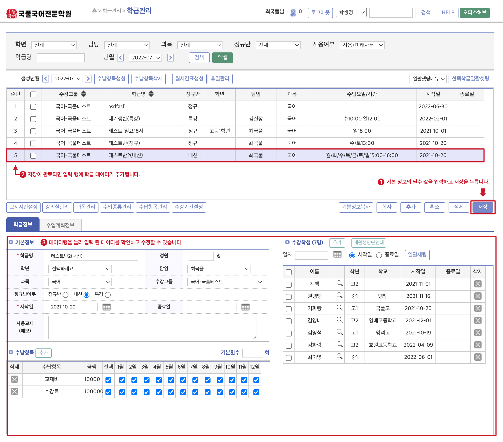

:::caution
저장을 하지 않아도 수업계획정보 및 수납 항목을 추가 할 수 있으나, 기본정보를 입력하고 우선 저장 후 진행하는 것을 권장드립니다.
:::

### 수업 계획 정보 추가
#### A. 일괄 세팅 (권장)
> _수업 요일에 따라 담당 강사, 시간, 강의실이 바뀌지 않는 경우_

① 수업 요일, 시작 시간, 담당 및 강의실을 입력하고 **`일괄세팅`** 버튼을 누릅니다. 시간, 담당, 강의실 항목은 공통 정보 설정(코드 관리)을 따릅니다.

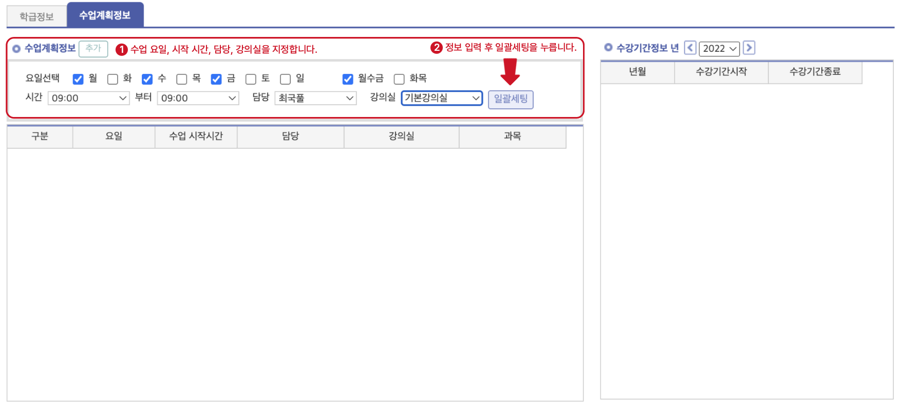

② 입력된 정보에 맞춰 수업 계획이 한 번에 추가 됩니다. 당해년도의 수강 기간 정보는 자동 추가 됩니다.
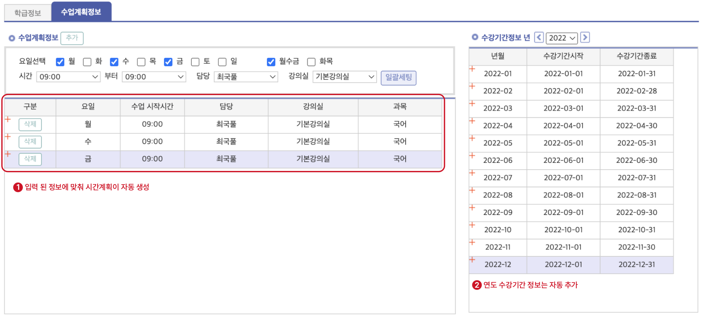

③ `저장` 버튼을 눌러 입력된 데이터를 저장합니다.

:::caution 시작 시간과 종료 시간
시간 별로 수업의 정보가 달라지는 경우가 아니라면 ___시작 시간과 종료 시간을 동일하게 설정___ 하는 것을 권장드립니다. 
수업은 한 시간 단위로 생성되므로 시작 시간과 종료 시간이 다를 경우 한 요일에 여러 개의 수업이 생성됩니다.

  
<b>시작 시간과 종료 시간을 다르게 설정했을 경우</b>

  

    
  

:::

#### B. 개별 세팅
> _요일에 따라 강사, 시간, 강의실 등이 바뀌거나 같은 수업 일에 여러명의 강사가 들어가는 경우_ 

① `추가` 버튼을 눌러 입력행을 추가 합니다. 
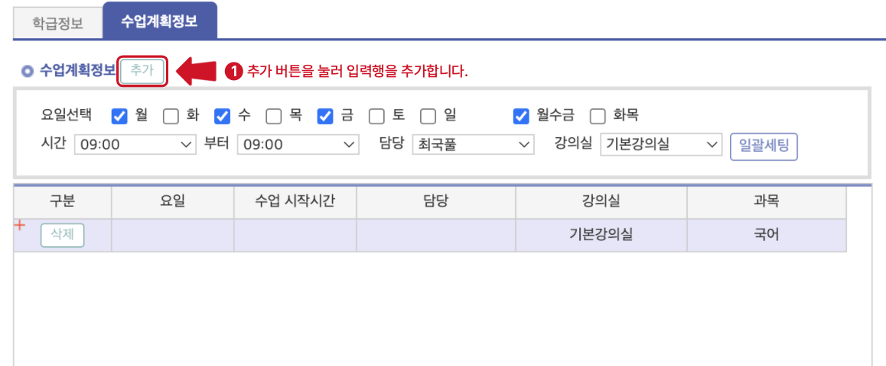

:::info
입력 과정에서 개별 입력 행을 제거하고 싶을 때는 __`삭제`__ 버튼을 누릅니다.
:::
 

② 추가 된 입력 행에 수업에 대한 개별 정보를 입력합니다. 
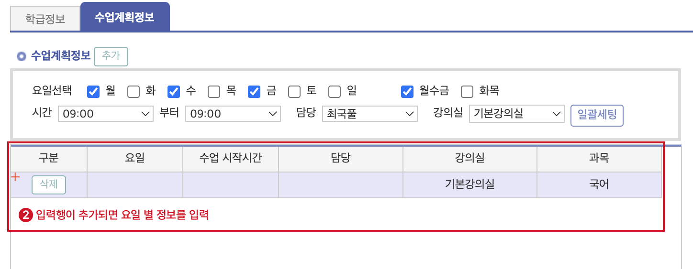

③ 다시 `① → ②` 를 반복하여 요일 별 수업 게획을 추가 합니다. 
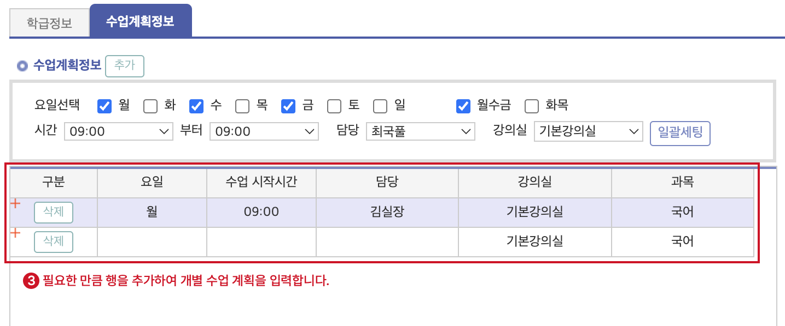

④ 필요한 데이터가 입력 완료 되었다면 **`저장`** 을 눌러 완료합니다.

### 수납 항목 추가
개별 수업에 수납 항목을 추가 합니다.
학급을 선택하고 __`학급정보`__ 탭의 하단에 있는 __`수납항목`__의 __`추가`__버튼을 누릅니다.
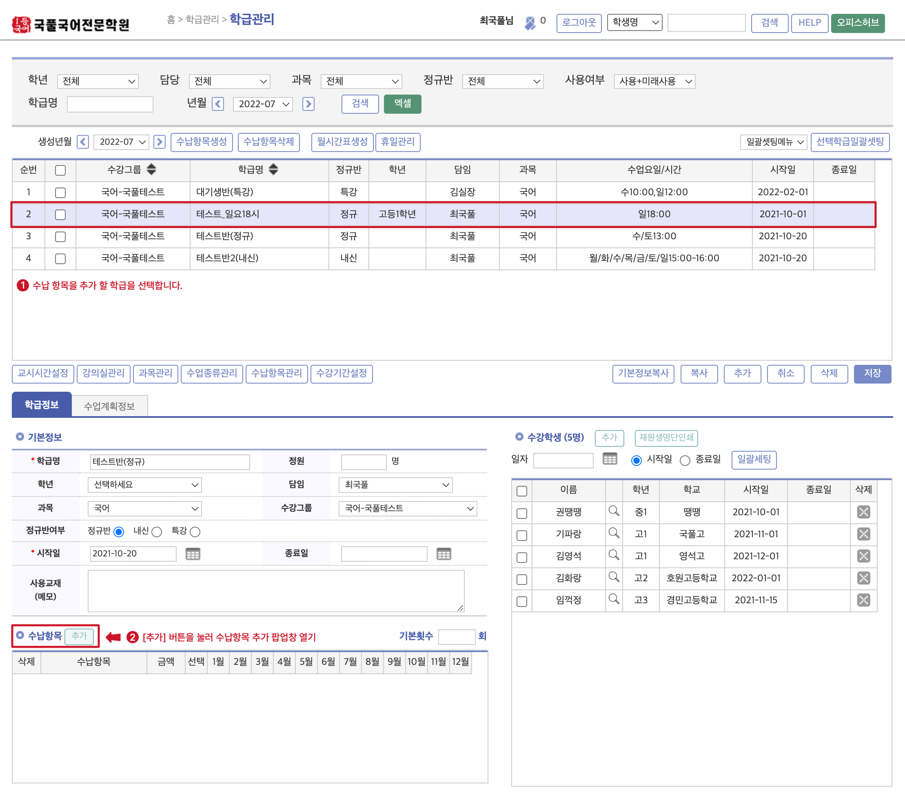

수납항목 팝업창이 뜨면 추가 할 수납 항목의 체크박스를 선택하고 아래의 __`추가`__ 버튼을 눌러줍니다. (복수 선택 가능)

수납항목이 추가 된 것을 확인하실 수 있습니다. 삭제 버튼을 눌러 개별 수납 항목을 제거할 수 있습니다.

- __`저장`__ 버튼을 눌러 데이터를 저장합니다.

## 기존 정보를 이용해 추가하기
기존에 추가된 학급의 기본 정보를 복사하여 신규 학급을 추가 할 수 있습니다.
:::caution 주의
`수업계획` 및 `수납항목`은 복사 되지 않습니다.
:::

① 복사할 기본 정보가 있는 학급을 선택합니다.  
② __`기본정보복사`__ 를 눌러 신규 입력 행을 추가 합니다.
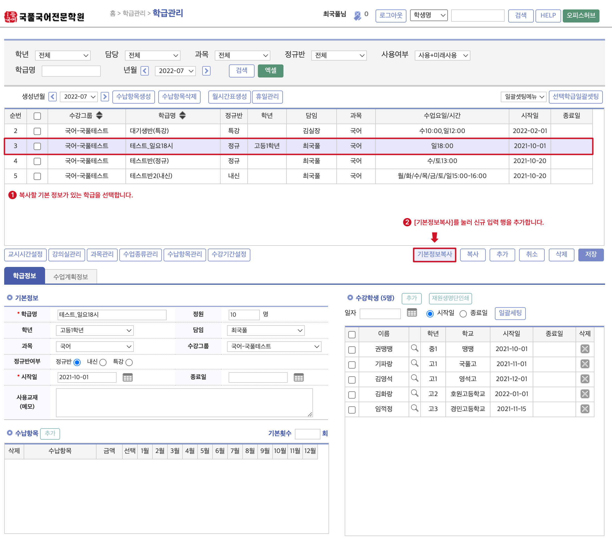

③ 신규 입력 행이 추가 됩니다.  
④ ① 에서 선택했던 학급의 기본 정보를 그대로 가지고 옵니다.
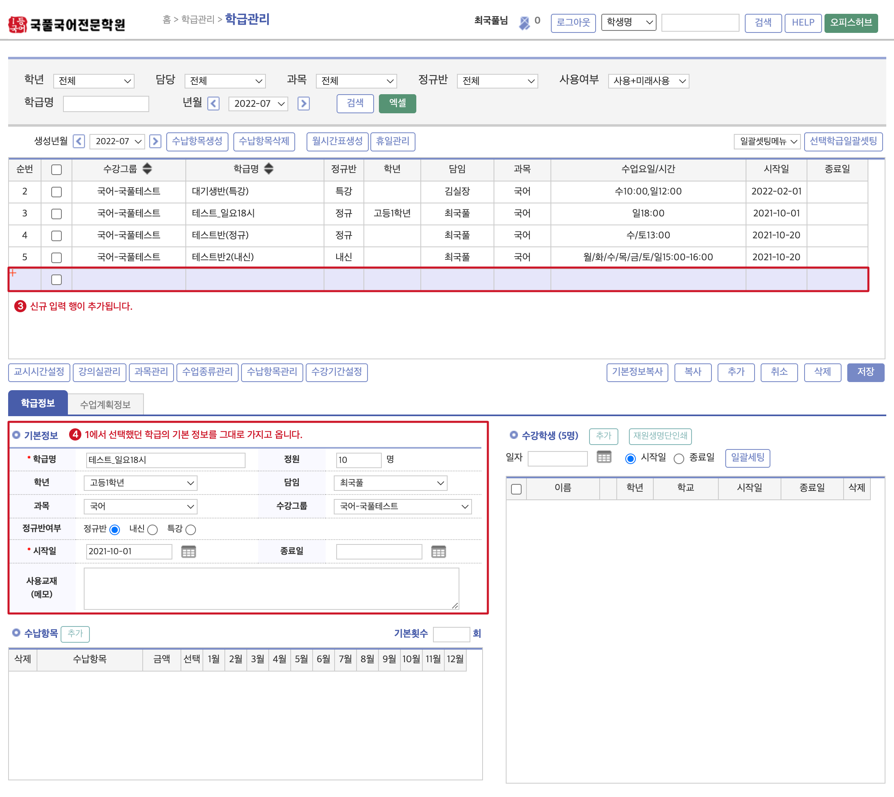
⑤ __`저장`__을 눌러 데이터를 저장합니다.
