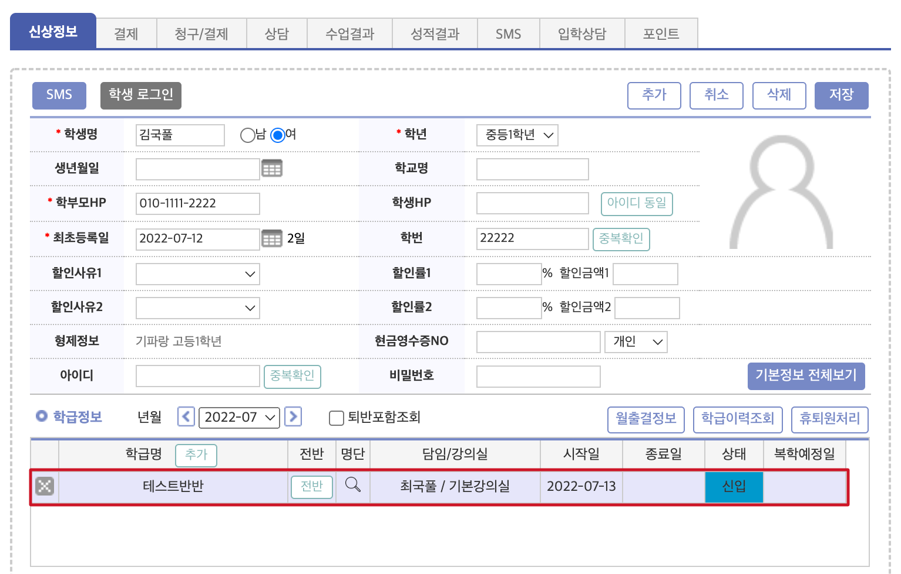

import EmbeddedVideo from "../../src/components/EmbeddedVideo";

# 학생 추가 및 입반
수납 및 수업 관리를 위해 학생을 시스템에 추가하고 학급에 입반 시킵니다.
:::info 사용 메뉴
__` 기본메뉴 ` → ` 학생관리 ` → ` 학생관리 `__
:::

## 학생 추가하기
### 입력 준비
우측 상단의 `추가` 버튼을 눌러 입력 행을 추가합니다.

### 학생 정보 입력
학생의 신상 정보를 입력합니다. `*`로 표시된 필수 정보는 반드시 입력해야 합니다. 
자동 생성되는 정보가 있으므로 첫 입력 시에는 아래의 `개별 항목 설명`를 자세히 읽어주세요.

#### 개별 항목 설명
- 학생명 : `필수` 학생의 이름 및 성별
- 학년 : 학년을 선택 (`코드관리` - `학교구분/학년` 에서 지정된 값)
- 생년월일 : 학생의 생년월일
- 학교명 : 재학 중인 학교명
- 학부모HP : `필수` 학부모님의 휴대전화 번호
- 학생HP : 학생의 휴대전화 번호
- 최초등록일 : 학원에 최초 등록 한 날짜
- 학번 : __`자동생성`__ 부모의 휴대전화 끝 4자리 + 임의의 숫자(0~9)
- 할인사유, 할인율 : 수강료 할인 항목과 할인율을 지정
- 형제정보: __`자동매칭`__ 학부모의 휴대전화 번호와 동일한 학생 정보를 표시
- 현금영수증NO : 현금영수증 발급에 사용할 전화번호를 입력 (개인/사업자 선택 가능)
- 아이디 : 홈페이지에 접속하기 위한 학생 아이디 __`학생HP 입력시 자동 입력`__
- 학생사진 : 학생 사진을 등록 합니다.

### 저장 및 수정
필수 정보를 입력 하고 __`저장`__을 누르면 학생 데이터가 저장되고 `비원생`으로 등록이 됩니다. 등록이 완료 되면 학생의 정보를 수정할 수 있습니다.

:::tip 사용 팁 : 학생의 상태
학생의 상태는 __수강 이력__을 기준으로 구분 됩니다.
- 신입생 : 직전 달 수강 이력이 없는 학생
- 재원생 : 이전 달의 수강 이력이 있고, 현재 학급에 배정되어 있는 경우
- 퇴원생 : 모든 수강 이력이 종료 된 학생
- 휴원생 : 휴원 처리가 된 학생
- 비원생 : 수강 이력이 없는 학생
:::

저장 이후에는 학생을 검색하고 수정할 수 있습니다.  
학생 검색에 대한 자세한 내용은 [링크 추가 예정](##)에서 확인할 수 있습니다.

### 추가 정보 입력
- 신상정보의 비밀번호의 오른쪽에 위치한 __`기본정보 전체보기`__를 누르면 입력창이 아래로 확장되어 학생의 추가 정보를 관리할 수 있습니다.

- 창이 확장되면 버튼이 __`기본정보 요약보기`__로 변경 되고 다시 눌렀을 때 창이 원래대로 축소됩니다.

#### 개별 항목 설명
- 학부모명 : 학부모님의 이름 및 유형(부, 모)을 지정. 최초 학생 등록시 `(학생이름)모`로 저장됩니다.
- 첫 수업 : 학생의 첫 수업 날짜를 기록
- 추가 연락처: 추가로 등록해야 할 연락처가 있을 경우 기입. 문자 발송 여부 선택 가능
- 클리닉 : 학생에게 배정된 클리닉의 요일과 시간을 지정할 수 있습니다. (1개)
- 이메일 : 학생의 이메일 주소
- 닉네임 : 학생에게 별도의 닉네임을 부여할 수 있습니다.
- 우편번호, 주소 : 학생의 주소 정보
- 승차위치 : 차량 이용 정보를 등록 기타기능안내 - 추후 링크 추가 예정
- MEMO : 개인 학생 별 메모 공간입니다. `메모추가`를 이용해 입력 시 기록 날짜와 입력한 사람이 자동 추가 됩니다.

## 학급에 학생 입반 시키기
수납 및 수업 결과 기록을 위해서 학생을 학급에 넣어주는 과정(입반)을 진행해야 합니다.

### 학생 선택
🧒 먼저 입반 시키려는 학생을 검색하여 선택합니다.
- 비원생 상태이므로 학생 상태를 <ins>전체</ins> 또는 <ins>비</ins>로 지정하여 이름을 검색합니다.
- 검색 된 학생을 선택하여 학급 정보가 없는 것을 확인합니다.

### 학급 선택
- 학급정보에서 추가 버튼을 눌러 입력 행을 추가 합니다.

- 입력 행의 `학급명` 열 아래의 빈칸을 누르면 선택 박스가 생성 되고 다시 한 번 더 누르면 학급을 선택할 수 있습니다.

### 시작일 및 종료일 지정
#### 시작일
- 반을 선택하고 수업 시작일을 지정합니다. 학생이 학급에서 최초 수업을 시작하는 날짜입니다.

#### 종료일
- 종료일이 정해지지 않은 경우 입력하지 않고 진행합니다. 별도 종료일을 지정하면 해당 날짜 이후 자동 퇴반 처리 됩니다.

### 저장 및 입반 확인
학급을 선택하고 시작일 및 종료일을 지정한 후 __`저장`__을 누르면 학급에 학생이 추가 됩니다. 
담임과 강의실은 저장 시점에서 학급 정보와 매칭됩니다.

### 수납 예정 항목 추가
입반이 완료 된 학생에게 수업에 대한 수강료를 추가할 수 있습니다.
:::caution
개별 수업에 대한 수강료가 추가되어 있어야 합니다. 
__참고 링크__ : __[학급 세팅 - 수납 항목 추가](/first-setting/class-setting/#수납-항목-추가)__
:::

- 학생을 검색하고 수강료를 추가할 학급을 선택합니다. ___추가 설명이 필요할지도??___

- 몇 월 까지의 수강료를 발생시킬 것인지 선택하고 __`학급항목가져오기`__를 클릭하면 선택한 월 까지의 수강료가 추가됩니다 🤗

- 자세한 수납 방법은 [수납 - 링크 추가 예정]을 참고해주세요

### 영상 보기: 입반 및 수납 항목 추가
넣을 지 고민 중 입니다...🤔 한눈에 요약해서 보여주기는 좋겠으나 시간이 많이 걸릴 것 같아서...아래는 그냥 예시입니다.
<EmbeddedVideo
  src={"https://player.vimeo.com/video/729473672?h=4fb50e5f6a&badge=0&autopause=0&player_id=0&app_id=58479"}
  title={"수납항목추가"}/>

